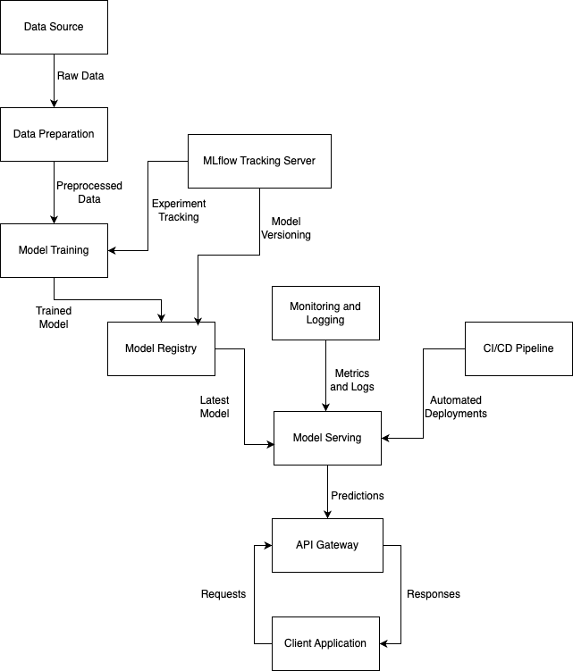

# Sales Forecasting Model

## Project Overview

This project develops a sales forecasting model to help Albert Heijn run successful promotion campaigns. This model predicts the effect of promotions on sales for various items which is crucial for campaign planning and stock level discussions with suppliers.
The model, built with a `RandomForestRegressor` from Scikit-learn, and encompasses data preprocessing, model training, evaluation, and an API for predictions.

## Table of Contents

- [Project Overview](#project-overview)
- [Directory Structure](#directory-structure)
- [Installation](#installation)
- [Data](#data)
- [Usage](#usage)
- [Model Evaluation](#model-evaluation)
- [Testing](#testing)
- [Docker Setup](#docker-setup)
- [Contributing](#contributing)
- [License](#license)

## Directory Structure

```
SALES_FORECASTING/
├── app/
│   ├── __init__.py
│   ├── config.py
│   ├── data_preparation.py
│   ├── inference.py
│   ├── utils.py
│   └── train.py
├── data/
│   └── (Place your datasets here)
├── models/
│   └── (Trained models will be saved here)
├── tests/
│   ├── test_data_preparation.py
│   ├── test_inference.py
│   ├── test_utils.py
│   └── test_train.py
├── Dockerfile
├── pyproject.toml
├── README.md
```

## Installation

### Prerequisites

- Python 3.11+
- Poetry (for managing dependencies)
- Docker (optional, for containerized deployment)

### Steps

1. Clone the Repository:
   ```
   git clone https://github.com/yourusername/sales-forecasting.git
   cd sales_forecasting
   ```

2. Install Dependencies:
   ```
   poetry install
   ```

3. Set Up Configuration:
   Edit the `app/config.py` file to specify paths and other configuration parameters.

## Data

Place your datasets in the `data/` directory. The data should be in CSV format with necessary columns (UnitSales, DateKey, StoreCount, ShelfCapacity, etc.). Use `data_preparation.py` for preprocessing if needed.

## Usage

### Training the Model

1. Prepare the Data:
   ```
   poetry run python app/data_preparation.py
   ```

2. Train the Model:
   ```
   poetry run python app/train.py
   ```

### Making Predictions

1. Run the Flask App:
   ```
   poetry run python app.py
   ```

2. Send a Prediction Request:
   Send a POST request to the `/predict` endpoint with the required input features in JSON format. For example:

   ```bash
   curl -X POST -H "Content-Type: application/json" -d '{"StoreCount": 5, "ShelfCapacity": 100, "PromoShelfCapacity": 50, "IsPromo": 1, "ItemNumber": 12345, "CategoryCode": 678, "GroupCode": 9, "UnitSales": 10, "DateKey": "20230829"}' http://127.0.0.1:5000/predict
   ```

3. Response:
   The API will return the predicted sales in units.

## Model Evaluation

The model is evaluated using RMSE (Root Mean Squared Error) and MAE (Mean Absolute Error). These metrics are logged using MLflow during the evaluation process in the `inference.py` script.

## Testing

Unit tests are provided to ensure the correctness of the data preparation, training, and inference processes.

1. Run the Tests:
   ```
   poetry run pytest tests/
   ```

## Docker Setup

To containerize the application, use the provided Dockerfile.

1. Build the Docker Image:
   ```
   docker build -t sales-forecasting-app .
   ```

2. Run the Docker Container:
   ```
   docker run -p 8080:5000 sales-forecasting-app
   ```

The Flask API will be available at `http://localhost:8080`.

## Architecture


